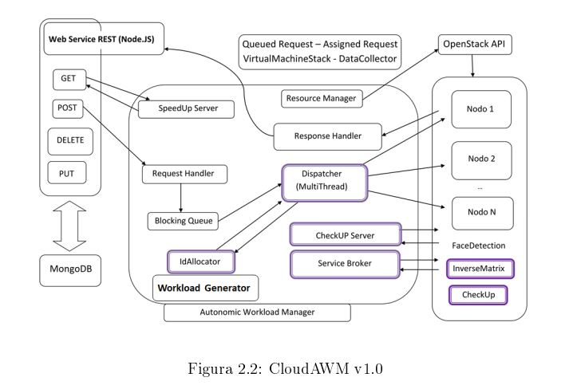
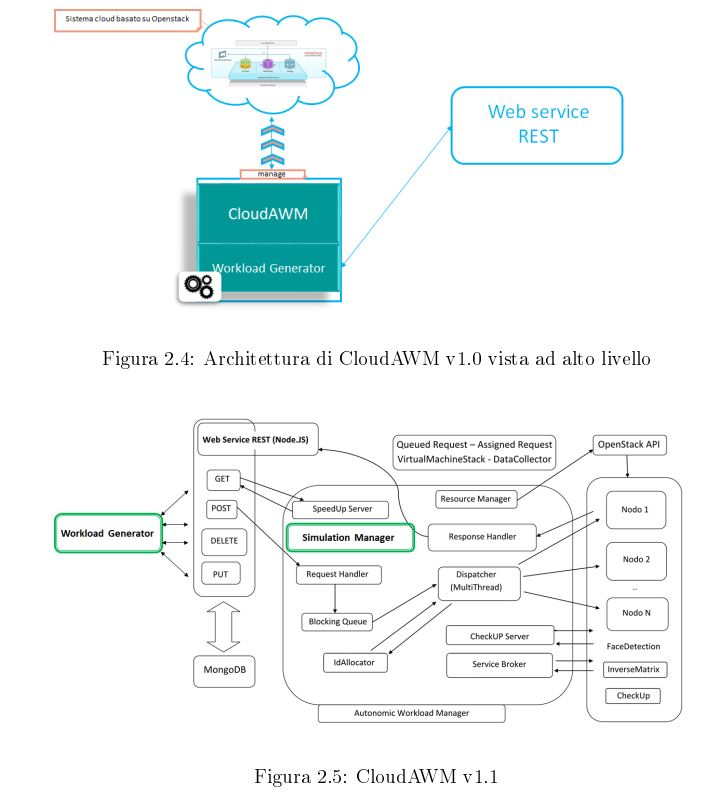

# Docker Project
> Progetto Ingegneria magistrale Docker CloudAWM

shift + ctrl + m per visualizzare


# Cloud computing
> Federico Torreggiani, Tesi magistrale informatica


1. sviluppato grazie alla banda larga, **CLOUD** ;
2.	molti investimenti di aziende e privati;
3.	vista come una black box che offre web service (SaaS, HaaS, IaaS)
4.	macchine virtuali sono istanziate su un singolo hardware
5.	autonomic computing consiste nell'autogestione del sistema. Deve esistere un sistema per regolare le decisioni in automatico viene chiamato automatic manager.
6.	Algoritmi di auto-scaling hanno come obbiettivo quello di minimizzare un determinato indice di costo.
7.	Il progetto di Torreggiani si basa su IaaS e allocazione di macchine virtuali in base ad un carico.

## Algoritmi di autoscaling
1.	Algoritmo a soglia
2.	Algoritmo reinforcement learning
3.	Algoritmo basato sulla teoria delle code
4.	Algoritmo basato sulla teoria del controllo

Usa __auto-scaling orizzontale__, l'input del sistema è rappresentato
dal numero di _macchine virtuali_ da allocare e deallocare
I controllori più utilizzati sono:
* Controllori guadagno statico
* Controllori adattivi
* Controllori riconfiguranti
* Model predictive Controllori

## Progettazione architettura
Progetto di reingegnerizzazione del software CloudAWM da _v1.0 a v1.1_. La versione OStak è Mitaka.

Componenti fondamentali del sistema:
* Restful interface
* Openstack framework to manage physical machine.
* CloudAWM for auto-scaling and optimization.


Openstack ha configurazione __Master-Slave__.
Master viene chiamato _Controller_ per la gestione mentre Compute sono i figli per la funzione di calcolo.



La funzionalità di spicco di AWM tuttavia è quella di gestire (modulo Resource
Manager e Controllers) lo scaling orizzontale del sistema cloud in modo autonomico
secondo le regole dettate dall'algoritmo selezionato.
> Nella versione 1.0 AWM presenta un modulo denominato **Workload Generator**
progettato allo scopo di generare client in grado di produrre del carico da poter
applicare al sistema, principalmente a scopo simulativo.
Attraverso la progettazione e l'implementazione di un nuovo algoritmo di
auto-scaling basato sulla tecnica del Model Predictive Control [22] propria della
teoria del controllo si è fornito al sistema cloud un mezzo ecace per la gestione
autonomica delle risorse di virtualizzazione



AWM v1.1 è stato progettato per essere sempre attivo come middleware per l'intero sistema cloud.


## Modello Matematico per CloudAWM 1.1
> SaaS : Software as a Service

è stato possibile formulare un problema di
ottimizzazione in grado di minimizzare la funzione di costo ed il numero di richieste
non servite entro il successivo istante di campionamento secondo l'approccio del
Model Predictive Control [22] (Figura 2.9) e rispettando i vincoli imposti dal sistema
stesso.

### Input
* T : periodo campionamento. Si assuma di **aggiornare il sistema ogni T second**
* T<sub>r</sub> : tempo medio di risposta del sistema
* p : numero processi attivi al passo __k__
* r : rappresenta il numero di richieste da servire
al passo k
* η : rappresenta il numero di nuove richieste sopraggiunte durante il periodo
di campionamento precedente. [(k − 1)T; kT[
* u : coefficiente di scaling (allocazione macchine) al tempo k. da attivare al passo _kT._


Sistema:
>p(k + 1) = p(k) + u(k)

>r(k + 1) = maxfr(k) − TTr p(k + 1); 0g + η(k)

>p(0) = p0

>r(0) = r0

```python
def ciao():
   print("ciao")
```
